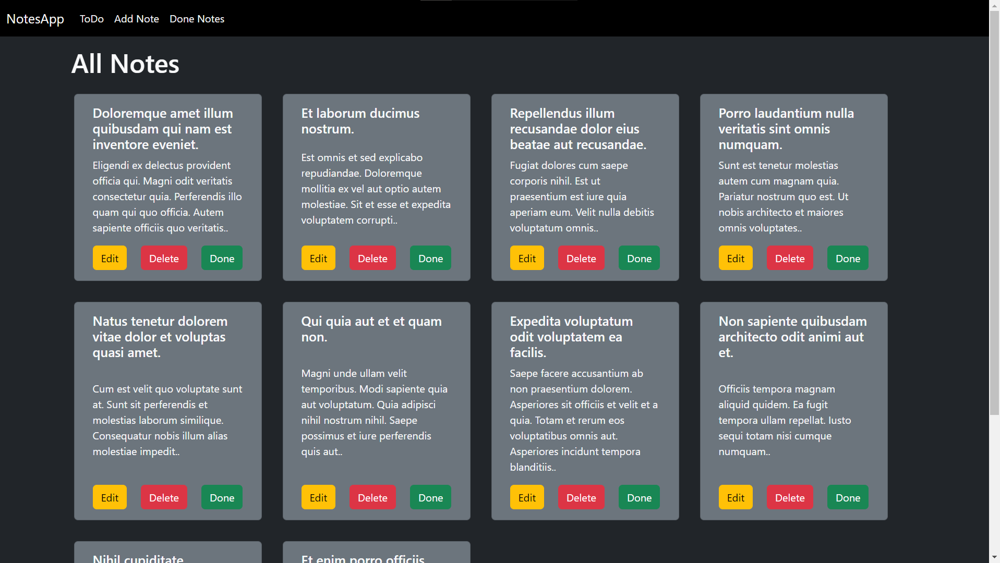
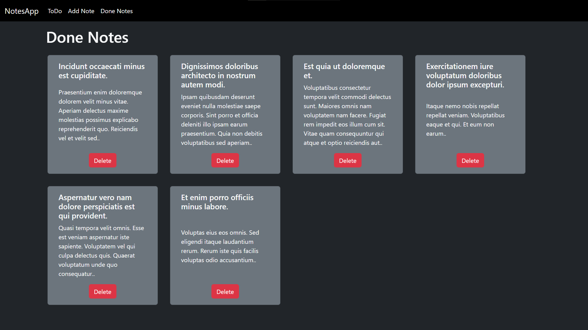
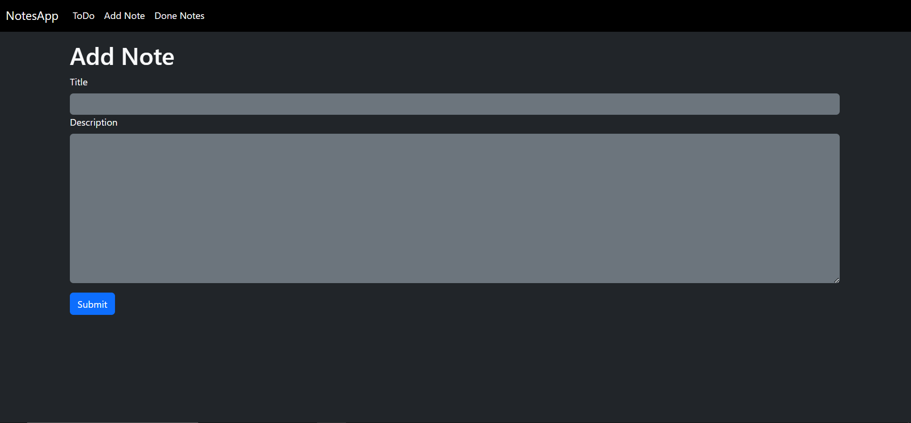
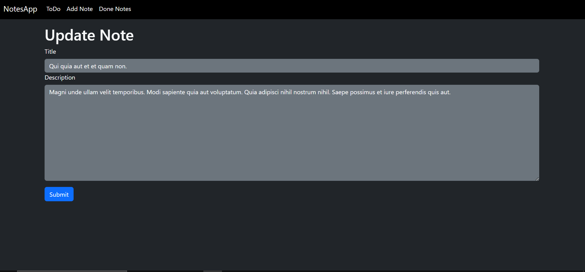

# Notes Web App

## This is a web based notes app where you can add/delete/edit/mark done your notes.

#### Technalogies that are used
##### Frontend
- Laravel Blade Templete
##### Backend
- Laravel (MVC Model)

## To use this follow the following commands
- First install Xammp and run Apache and MySQL servers
- After that you have to create tables and Database by executing the command (php artisan migrate)
- Run the project by executing the command (php artisan serve)
- After that the project will be run on local server (127.0.0.1) on port 8000
- You can view the project by go to 127.0.0.1:8000 or localhost:8000 in URL bar in any web browser

---

### All Notes Page View

---

### Done Notes Page View

---

### Add New Note Page View

---

### Edit Exsisting Page View

---